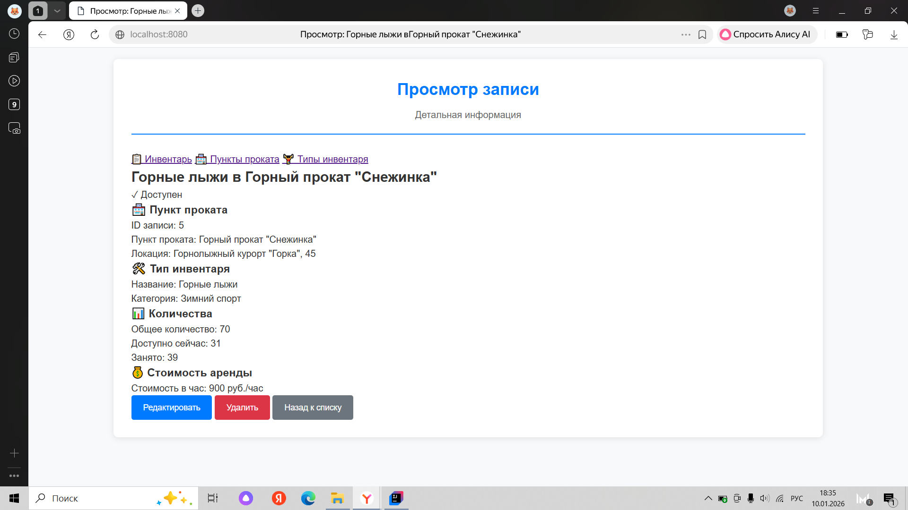
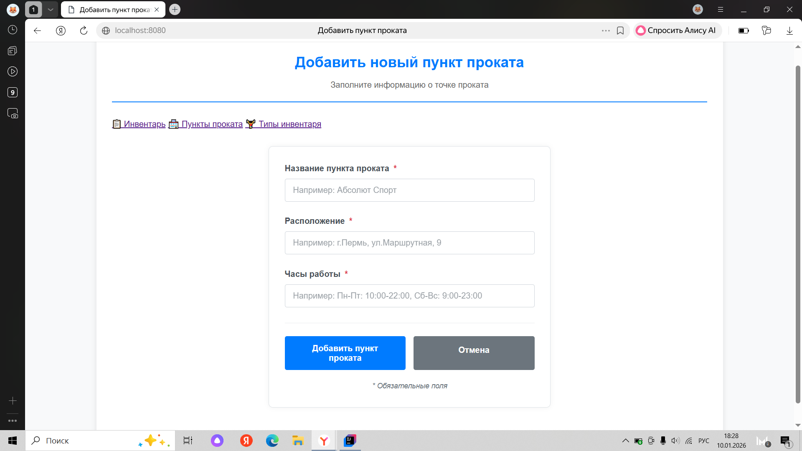
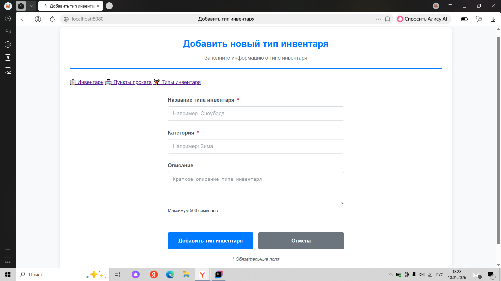

# Сивкова Екатерина ИТ-16. Проект для итоговой работы по дисциплине "Язык программирования Java"

## Задание
Необходимо разработать Spring Web MVC или REST+JS проект с использованием базы данных, разработанной по дисциплине Базы данных и СУБД. Программа должна иметь интуитивно-понятный дружественный интерфейс и проверку вводимых значений. В программе должны присутствовать классы. 

Необходимо реализовать функции: 
- просмотр данных из базы;
- редактирование данных в базе;
- удаление данных из базы; 
- добавление данных в базу.

Функции должны быть доступны для каждой таблицы. База данных должна содержать минимум 3 связные таблицы.

## Интерфейс приложения

Проект представляет Spring Boot Web MVC приложение для управления прокатом инвентаря с тремя таблицами БД.

## Функциональность
1. Таблица "Пункты проката":
- Просмотр списка пунктов проката
- Добавление новых пунктов проката
- Редактирование существующих пунктов проката
- Удаление пунктов проката
- Поиск по названию, расположению и часам работы
- Проверка вводимых данных (уникальность адреса)

2. Таблица "Типы инвентаря":
- Просмотр списка типов инвентаря
- Добавление новых типов инвентаря
- Редактирование существующих типов инвентаря
- Удаление типов инвентаря
- Поиск по названию и категории
- Проверка вводимых данных (уникальность названия без учета регистра)

3. Таблица "Инвентарь":
- Просмотр списка доступного инвентаря во всех пунктах проката
- Добавление новых записей о наличии инвентаря
- Редактирование существующих записей (количество, стоимость)
- Удаление записей о наличии инвентаря
- Проверка вводимых данных (уникальность комбинации "пункт проката + тип инвентаря"

## Структура проекта
<pre>
src/
├── main/
│   ├── java/com/rental/app/
│   │   ├── controller/
│   │   │   ├── AvailableEquipmentController.java        # контроллер доступного инвентаря
│   │   │   ├── EquipmentTypeController.java             # контроллер типов инвентаря
│   │   │   ├── HomeController.java                      # контроллер домашней страницы
│   │   │   └── RentalPointController.java               # контроллер пунктов проката
│   │   ├── entity/
│   │   │   ├── AvailableEquipment.java                  # класс с сущностью доступного инвентаря
│   │   │   ├── EquipmentType.java                       # класс с сущностью типа инвентаря
│   │   │   └── RentalPoint.java                         # класс с сущностью пункта проката
│   │   ├── repository/
│   │   │   ├── AvailableEquipmentRepository.java        # репозиторий для работы с БД для доступного инвентаря
│   │   │   ├── EquipmentTypeRepository.java             # репозиторий для работы с БД для типа инвентаря
│   │   │   └── RentalPointRepository.java               # репозиторий для работы с БД для пункта проката
│   │   ├── service/
│   │   │   ├── AvailableEquipmentService.java           # бизнес-логика для доступного инвентаря
│   │   │   ├── EquipmentTypeService.java                # бизнес-логика для типа инвентаря
│   │   │   └── RentalPointService.java                  # бизнес-логика для пункта проката
│   │   └── RentalApplication.java                       # главный класс
│   ├── resources/
│   │   ├── static/css/
│   │   │   └── style.css                                # стили приложения
│   │   ├── templates/
│   │   │   ├── avaliableEquipments
│   │   │   │   ├── form.html                            # форма добавления/редактирования дступного инвентаря
│   │   │   │   ├── list.html                            # список доступного инвентаря
│   │   │   │   └── view.html                            # просмотр доступного инвентаря
│   │   │   ├── equipmentTypes
│   │   │   │   ├── form.html                            # форма добавления/редактирования типа инвентаря
│   │   │   │   ├── list.html                            # список типов инвентаря
│   │   │   │   └── view.html                            # просмотр типа инвентаря
│   │   │   ├── rentalPoints
│   │   │   │   ├── form.html                            # форма добавления/редактирования 
│   │   │   │   ├── list.html                            # список пунктов проката
│   │   │   │   └── view.html                            # просмотр пункта проката
│   │   └── application.properties                       # конфигурация
</pre>

## Диаграмма связей

